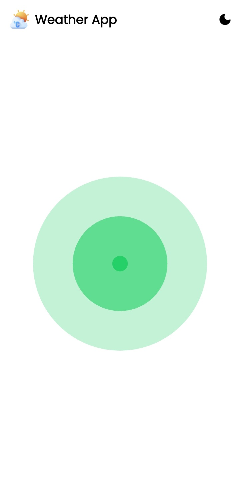
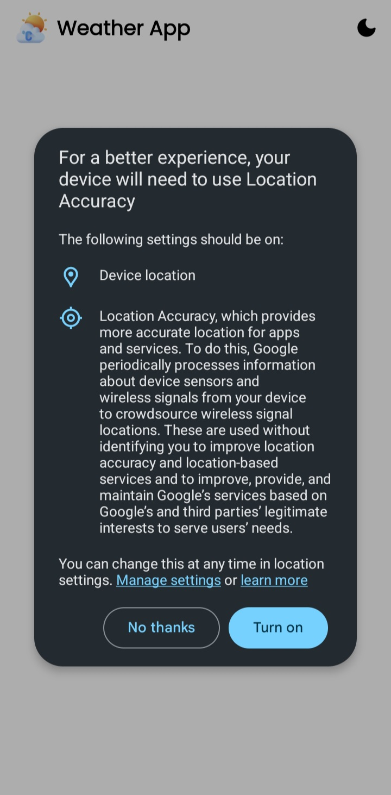
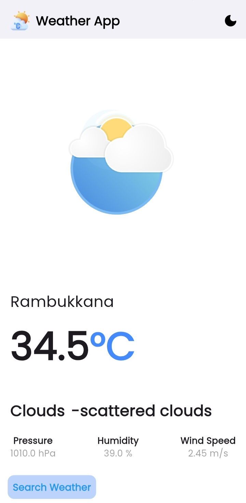
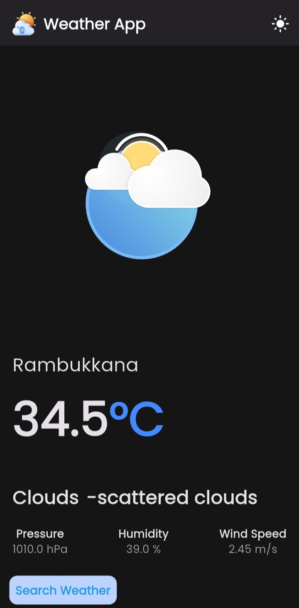
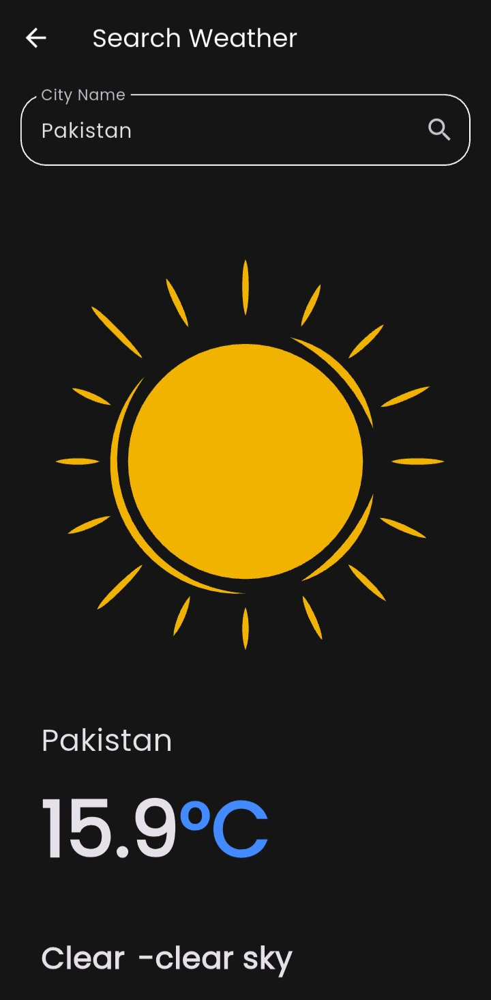

# Weather App ☀️🌙

[](https://flutter.dev)
[](https://dart.dev)
[](https://pub.dev/packages/provider)
[](https://pub.dev/packages/http)
[](https://pub.dev/packages/shared_preferences)
[](https://pub.dev/packages/lottie)

A beautiful, feature-rich Flutter weather application that provides real-time weather data with stunning animations and a seamless user experience. Built with modern Flutter practices including Provider for state management, HTTP for API calls, Shared Preferences for theme persistence, and Lottie for smooth animations.

## 📱 Screenshots

<p align="center">
  
  
  
  
   
</p>

<p align="center">
  <em>Loading State • Locato access • Light Mode • Dark Mode • Search</em>
</p>

## Features ✨

- **🌤️ Real-time Weather Data**: Fetches current weather conditions using OpenWeather API
- **🔍 City Search**: Search for any city worldwide location access
- **📍 Location Access**: Get weather for your current location with device location services
- **🌓 Dark/Light Mode**: Toggle between themes with persistence using Shared Preferences
- **🎬 Lottie Animations**: Beautiful, smooth weather animations based on conditions


## Tech Stack 🛠️

- **Framework**: Flutter (Dart)
- **State Management**: Provider
- **Networking**: HTTP package
- **Storage**: Shared Preferences
- **Animations**: Lottie
- **Location**: Geolocator / Geocoding packages
- **API**: OpenWeather API

## Lottie Animations
### Different animations for weather conditions:
- **☀️ Clear sky** - Sun animation
- **☁️ Clouds** - Cloud animation
- **🌧️ Rain** - Raindrop animation
- **⛈️ Thunderstorm** - Lightning animation
- **❄️ Snow** - Snowflake animation
- **🌫️ Mist/Fog** - Fog animation

## Prerequisites 📋

Before running this project, make sure you have:

- Flutter SDK (>= 3.0.0)
- Dart SDK (>= 2.17.0)
- Android Studio / VS Code with Flutter extensions
- An API key from [OpenWeather](https://openweathermap.org/api)
- Android device/emulator (API level 21+) or iOS device/simulator

## Installation 🚀

1. **Clone the repository**:
```bash
git clone https://github.com/Chameera-10/weather_app.git
cd weather_app
